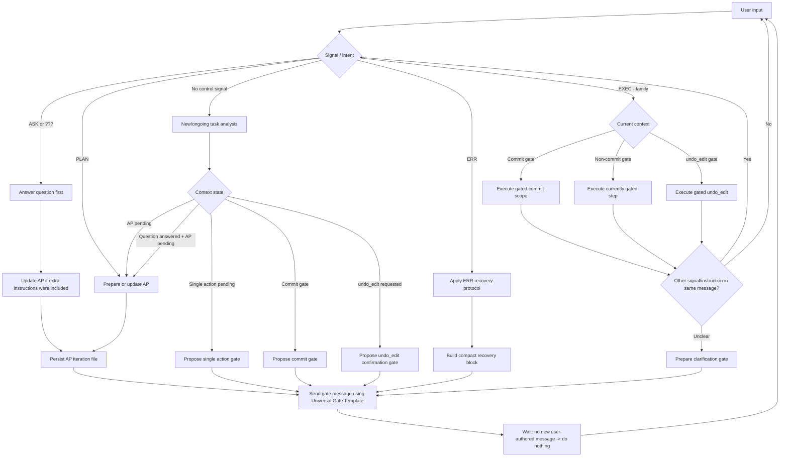

# AI Agent Gate Workflow (v1.1.0)

This document defines the gate workflow, pause lifecycle, and confirmation mechanisms for AI agents. It is the authoritative reference for gate‑related behavior extracted from `AGENTS.md`.

## Contents

1. Overview
2. Mermaid Workflow Diagram
3. Gate Message Definition (STRICT)
4. Universal Gate Template (STRICT)
5. Gate Lifecycle Invariants
6. Execution Signals (EXEC Family)
7. Specialized Gate Types
   - 7.1 Action Plan Gate
   - 7.2 Commit Gate
   - 7.3 undo_edit Gate (ROLLBACK)
   - 7.4 Clarification Gate
   - 7.5 Mixed-Signal Handling Examples
   - 7.6 Reusable Gate Phrasing Snippets
8. ERR Recovery Protocol in Gates
9. Gate Do's and Don'ts
10. Related References
11. Document History

---

## 1. Overview

A **gate** is a point in the workflow where the agent MUST stop, present a confirmation request, and wait for an explicit user signal before proceeding. The gate mechanism prevents agents from executing irreversible actions without user approval.

The workflow is triggered by user signals (`ASK`, `PLAN`, `EXEC`, `ROLLBACK`, `ERR`) or by the natural progression of a task requiring confirmation (e.g., before a commit).

---

## 2. Mermaid Workflow Diagram

**EXEC follow-up handling (STRICT):** When an input is handled through the `EXEC`-family branch, execute the currently gated action first, then re-check remaining signals/instructions from the same message.

- If remaining intent is clear, continue by re-entering signal/intent handling.
- If remaining intent is unclear, send a clarification gate using the Universal Gate Template and pause.

---

## 3. Gate Message Definition (STRICT)

- A **gate message** is an `<answer>` (or idempotent) message that concludes the current turn and requests explicit user confirmation.
- After sending a gate message, the agent MUST **stop** — no further actions, shell commands, or status updates are permitted until the user responds with a new `<issue_update>`.
- Echoing "waiting for input" via shell commands is a **violation** of this rule. The gate message itself is the sole blocking mechanism.
- **Pause Latch:** After emitting a gate message, the agent MUST NOT send additional status or tool-driven follow-up messages until new user input arrives.
- **No-Input Rule:** If no new user-authored message arrives, the agent MUST do nothing.

---

## 4. Universal Gate Template (STRICT)

Every gate message MUST include the following fields. Additional contextual information may be appended for specialized gates.

| Field | Description |
|-------|-------------|
| `Checkpoint` | Short identifier of the current state (e.g., "Action Plan Ready", "Pre-Commit") |
| `Overall Task` | AP title if available, otherwise a concise task description |
| `Last Action` | What the agent just completed (e.g., "Analyzed codebase", "Prepared commit message") |
| `Pending action` | What the agent will do upon confirmation |
| `Confirmation needed` | One of: `EXEC`, `EXEC+`, `EXEC++`, `EXEC+++`, `ROLLBACK`, or `None` (if no action is pending) |
| `Proposed commit message` | Full commit message when at a commit gate; otherwise `N/A` |

**Example (Action Plan gate):**

    Checkpoint: Action Plan v1.0 Ready
    Overall Task: AP image v1.0: Refactor derivative handling
    Last Action: Analyzed Bild::checkFiles() and prepared implementation plan
    Pending action: Apply patch to extract status helpers and add tests
    Confirmation needed: EXEC
    Proposed commit message: N/A

---

## 5. Gate Lifecycle Invariants

- **Canonical Gate Flow:** `Reached gate → send exactly one user-visible gate message → request EXEC-family signal → stop`.
- **No Polling Loop:** While waiting, do NOT run repeated status checks or emit repetitive "still waiting" updates.
- **Gate Loop Breaker:** If repeated "no new signal" reasoning is detected, emit one concise gate message and stop.
- **Pause Validity Invariant:** Waiting is valid only after a visible gate message has been sent in the same turn.

---

## 6. Execution Signals (EXEC Family)

| Signal     | Scope                                                                                                                                                                 |
|------------|-----------------------------------------------------------------------------------------------------------------------------------------------------------------------|
| `EXEC`     | Execute **only** the currently gated step (or commit only the gated scope).                                                                                           |
| `EXEC+`    | Execute the gated action **and continue** to the next planned step. In a commit gate: commit gated scope and continue.                                                |
| `EXEC++`   | Commit gate only: commit **all staged files** and continue; adapt commit message. Outside commit gates, interpreted as `EXEC`.                                        |
| `EXEC+++`  | Commit gate only: commit **all changed files** (`git add .` respecting ignore rules) and continue; adapt commit message. Outside commit gates, interpreted as `EXEC`. |
| `ROLLBACK` | Authorize an `undo_edit` action (see §7.3).                                                                                                                           |

For detailed commit‑signal behavior, refer to `.aiassistant/COMMIT.md`.

---

## 7. Specialized Gate Types

### 7.1 Action Plan Gate

- Triggered by `PLAN` keyword or when a non‑trivial `[CODE]` task reaches the planning stage.
- Agent MUST persist the AP iteration as a UAMF before presenting the gate message.
- Required order: `Persist AP UAMF -> send gate message -> wait for EXEC-family signal`.
- The gate message includes the full AP content in the response body.

### 7.2 Commit Gate

- Triggered before `git commit`.
- The gate message MUST include the complete proposed commit message in the `Proposed commit message` field.
- See `.aiassistant/COMMIT.md` for commit message format and tool usage.

### 7.3 undo_edit Gate (ROLLBACK)

- Triggered when the agent intends to call `undo_edit` in reaction to a user complaint, correction, or revert request.
- Authorization may be given via:
    - The keyword `ROLLBACK` in the user message, or
    - An `EXEC`‑family signal that clearly references the rollback.
- If authorization is absent, the agent MUST present a gate message with `Confirmation needed: ROLLBACK` (or `EXEC`).

### 7.4 Clarification Gate

- Triggered when user intent is unclear after processing multiple signals in one message.
- The gate message requests clarification of the ambiguous intent.

### 7.5 Mixed-Signal Handling Examples

**Example A: `ASK + PLAN`**
- Expected behavior:
  1. Provide the direct answer to `ASK`.
  2. Build/update AP and persist UAMF.
  3. Send one Action Plan gate.
- Minimal gate fields:
  - `Checkpoint`: `Action Plan Ready`
  - `Pending action`: `Execute AP step 1`
  - `Confirmation needed`: `EXEC`

**Example B: `EXEC` + extra instruction in same message**
- Expected behavior:
  1. Execute only the currently gated action first.
  2. Re-process remaining instruction(s).
  3. If another confirmation point is reached, send the next gate and stop.

**Example C: rollback intent**
- Expected behavior:
  1. If `ROLLBACK` (or explicit `EXEC` for rollback) is present, call `undo_edit` in authorized scope.
  2. If authorization is missing, send rollback gate.
- Minimal gate fields:
  - `Checkpoint`: `Rollback Authorization Required`
  - `Pending action`: `Call undo_edit once`
  - `Confirmation needed`: `ROLLBACK`

### 7.6 Reusable Gate Phrasing Snippets

Use these concise phrases to reduce user-facing variability:

- `Last Action`: `Prepared Action Plan and persisted UAMF.`
- `Pending action`: `Execute AP step 1 (scoped implementation).`
- `Pending action`: `Create commit with the proposed message.`
- `Pending action`: `Apply one undo_edit rollback.`
- `Confirmation needed`: `EXEC` / `EXEC+` / `EXEC++` / `EXEC+++` / `ROLLBACK`.

---

## 8. ERR Recovery Protocol in Gates

When receiving an `ERR` input, the agent MUST apply the following recovery protocol:

**First `ERR`:**
- Reconstruct the latest confirmed state using explicit checkpoints.
- Respond with a compact recovery block containing:
    - `Checkpoint`
    - `Overall Task`
    - `Last confirmed step`
    - `Analysis of what might have caused the ERR situation`
    - `Pending action`
    - `Confirmation needed`

**Second consecutive `ERR`:**
- Switch to a short‑format response.
- Ask exactly one focused confirmation question.

**Safety gate after `ERR`:**
- Do not perform irreversible actions unless user intent is explicitly reconfirmed.

**Payload reduction fallback:**
- If delivery instability is suspected, split long responses into smaller chunks: `Summary → Next action → Confirmation needed`.

**Pause precedence:**
- If recovery behavior conflicts with gate requirements, the gate message takes precedence. Do not emit extra status updates while already waiting at a gate.

---

## 9. Gate Do's and Don'ts

**DO:**
- ✅ Send exactly one concise user-visible gate message.
- ✅ Request the appropriate execution signal (`EXEC`, `ROLLBACK`, etc.).
- ✅ Wait for a new user-authored `<issue_update>` before any further action.

**DON'T:**
- ❌ Run repeated status polling (e.g., multiple `git status --short` checks) while waiting.
- ❌ Emit tool-only or internal status updates in place of a user-visible gate message.
- ❌ Use shell `echo` statements to simulate a pause — these are not visible to the user as a blocking gate.
- ❌ Continue implementing after presenting a plan without an `EXEC` signal.

---

## 10. Related References

- [`AGENTS.md`](../AGENTS.md) – Core behavioral rules and instruction precedence.
- [`.aiassistant/COMMIT.md`](COMMIT.md) – Commit gate signals, message format, and tools.
- [`.aiassistant/ERROR_HANDLING.md`](ERROR_HANDLING.md) – Full ERR recovery protocol details.
- [`.aiassistant/tools/README.md`](tools/README.md) – Helper scripts and tooling.

---

## 11. Document History

| Version | Date       | Changes                                                                                                              | Agent Impact                                                                  |
|---------|------------|----------------------------------------------------------------------------------------------------------------------|-------------------------------------------------------------------------------|
| v1.1.0  | 2026-04-22 | Added AP persistence execution order, mixed-signal examples, and reusable gate phrasing snippets.                    | Improves gate consistency and clarifies multi-signal behavior.                |
| v1.0.0  | 2026-04-22 | Initial extracted version from `AGENTS.md` v2.0.4. Consolidates gate workflow, pause lifecycle, and signal handling. | Use as authoritative gate reference; follow Universal Gate Template strictly. |
