# Zoo Code History Repair

Scan and repair Zoo Code / Roo-code task history indexes and corrupted task metadata.

## Overview

Zoo Code stores task history as JSON files under `~/.zoo-code/globalStorage/wecode-ai.zoo-code/tasks/`. Each task directory contains:

| File | Purpose |
|------|---------|
| `history_item.json` | Task metadata (id, task prompt, token usage, size, etc.) |
| `api_conversation_history.json` | Full API conversation log (turns with content blocks) |
| `ui_messages.json` | UI-rendered message events (derived from API history) |
| `task_metadata.json` | Additional task context |
| `_index.json` | Global index of all tasks (`{version, updatedAt, entries: [...]}`) |

This tool detects and repairs common corruption patterns in these files.

## Quick Start

```bash
# Run directly (no install required)
npx zoo-code-history-repair scan

# Or install globally
npm install -g zoo-code-history-repair

# Scan for corruption
zoo-code-history-repair scan
zoo-code-history-repair scan --quiet                     # summary only
zoo-code-history-repair scan --json                      # machine-parseable JSON

# List corrupted task IDs only (with recoverability %)
zoo-code-history-repair list-corrupt
zoo-code-history-repair list-corrupt --json               # JSON array

# Validate task storage files against schema rules
zoo-code-history-repair validate                         # validate entire storage root
zoo-code-history-repair validate <file>                  # validate a specific file
zoo-code-history-repair validate --json                   # machine-parseable JSON
zoo-code-history-repair validate --warnings               # also show warning-level issues

# Repair a single task
zoo-code-history-repair repair-task <taskId>
zoo-code-history-repair repair-task <taskId> --force          # actually write
zoo-code-history-repair repair-task <taskId> --force-uim      # force ui_messages.json rebuild
zoo-code-history-repair repair-task <taskId> --fixed-input-token 50000  # override tokensIn

# Repair all corrupted tasks
zoo-code-history-repair repair-all --force
zoo-code-history-repair repair-all --verbose                  # show skipped tasks

# Rebuild the global index from disk
zoo-code-history-repair rebuild-index --force

# Delete a task directory + its _index entry
zoo-code-history-repair delete <taskId>
zoo-code-history-repair delete <taskId> --force               # actually delete

# Manage backup files
zoo-code-history-repair restore                              # list all backups
zoo-code-history-repair restore <taskId>                      # restore newest backup
zoo-code-history-repair restore <taskId> <timestamp>          # restore specific timestamp
zoo-code-history-repair restore <timestamp>                   # restore all tasks matching ts
zoo-code-history-repair restore --delete <taskId> --force     # delete backups
```

All write commands default to dry-run. Use `--force` to actually apply changes.
Dry-run messages are colorized red. Disable colors with `--no-color` or `NO_COLOR=1`.

```bash
# Print version information
zoo-code-history-repair --version       # "Zoo Code History Repair, v0.6.0"
zoo-code-history-repair --version-only  # "0.6.0"
```

All commands have detailed help available via `help <command>` (e.g. `zoo-code-history-repair help scan`).

### Scripting / CI Integration

`scan` and `list-corrupt` support `--json` for machine-parseable output and exit with non-zero
when corruption is detected (exit code = corruption count, capped at 255):

```bash
# Check for corruption in CI
zoo-code-history-repair scan --json --quiet && echo "All clean"

# Parse corruption details
zoo-code-history-repair scan --json | jq '.corruptions[] | {id: .taskId, reasons: .reasons}'
```

> **Tip:** Use `npx` to run the latest version without installing globally. Ideal for one-off repairs or CI pipelines.

## Validation

The `validate` command checks task storage files against comprehensive schema rules. It produces structured, machine-readable issue reports with error codes, severity levels, and dotted field paths:

```bash
# Validate everything
zoo-code-history-repair validate

# Validate a specific file
zoo-code-history-repair validate ~/.zoo-code/.../_index.json

# JSON output for CI
zoo-code-history-repair validate --json --warnings
```

Each validated file type uses Zod schemas (from `@roo-code/types` or our own extensions) with corruption heuristics layered via `.superRefine()`:

| File | Validates |
|------|-----------|
| `_index.json` | `version`=1, `updatedAt` (finite number), `entries` array, per-entry Zod parsing via `historyItemSchema` + cross-reference integrity via `.superRefine()` (dangling `parentTaskId`/`delegatedToId`/`childIds`/etc.) |
| `history_item.json` | Zoo Code's canonical `historyItemSchema` extended with `.superRefine()` for corruption heuristics: placeholder task names, zero fields, UUID validation, status consistency (`delegated`→`delegatedToId`, `active`→`awaitingChildId` forbidden, `"interrupted"` status added) |
| `api_conversation_history.json` | Array structure, turn-level `role` ("user"/"assistant"), `content` array with Zod block validation, interrupted task detection |
| `ui_messages.json` | Array structure, Zod per-event schema aligned with Zoo Code's 28 `say` values and 11 `ask` values, optional fields (`partial`, `reasoning`, `images`, etc.) |
| `task_metadata.json` | Zod schema for `files_in_context` array (path, record_state, record_source, timestamps) with optional top-level passthrough |

All validators produce errors (invalid data) and warnings (suspicious but non-fatal). Use `--warnings` to see both; by default only errors are shown.

## Corruption Detection

The `scan` command detects these corruption patterns:

| Reason | Description |
|--------|-------------|
| `placeholder_task_name` | `task` field matches "Task #N" / "Task #N (Incomplete)" pattern |
| `zero_size` | `size` field is 0 or null/missing |
| `missing_task_text` | Disk `task` field is empty or whitespace-only |
| `missing_history_item` | `history_item.json` does not exist or is unreadable |
| `invalid_json` | (not yet produced) A JSON file is syntactically invalid or truncated |
| `missing_task_dir` | (not yet produced) Index entry has no corresponding task directory |
| `empty_ui_messages` | `ui_messages.json` is an empty array |
| `empty_api_history` | `api_conversation_history.json` is an empty array |
| `index_orphan` | Entry in `_index.json` has no matching task directory on disk |
| `folder_orphan` | Task directory exists on disk but is absent from `_index.json` |
| `ui_sync_mismatch` | (opt-in) `ui_messages.json` differs from ACH-derived reconstruction |
| `interrupted_task` | Task appears interrupted (last turn ends with `tool_use` + other corruption) |
| `zero_tokens` | `tokensIn`/`tokensOut`/`totalCost` all 0 but `api_conversation_history.json` has entries |

Run `zoo-code-history-repair help scan` for detailed explanations of each reason.

## Repair Capabilities

### `ui_messages.json` Reconstruction

Rebuilds the complete `ui_messages.json` from `api_conversation_history.json` using deterministic mapping rules:

| API block type | Role | UI `say` | Payload |
|---------------|------|----------|---------|
| `text` | user | `text` | Raw text |
| `text` | assistant | `text` | Raw text |
| `reasoning` | assistant | `reasoning` | Raw text |
| `tool_use` | assistant | `tool` | JSON descriptor with camelCase tool name |
| `tool_result` | user | `tool` | Concatenated result content |

Tool names are normalized from `snake_case` to `camelCase`. Timestamps are derived from turn-level `ts` with monotonic +1ms increments.

### `task` Field Extraction

Extracts the original user prompt from the first `<user_message>...</user_message>` block in `api_conversation_history.json`.

### Token Field Recovery

Recovers `tokensIn`/`tokensOut`/`totalCost`/`cacheReads` when zeroed out. Priority:

1. **Index recovery** — copy from `_index.json` backup (exact)
2. **Estimation** — output tokens from ACH assistant text (3.44 chars/token), input tokens from ACH user text (4.0 chars/token under-estimate), cost from provider pricing
3. **User override** — `--fixed-input-token <n>` to set tokensIn explicitly; `--fixed-input-token 0` to disable estimation

### `size` Field Calculation

Computes the correct `size` value as the sum of compact UTF-8 byte sizes of all JSON files in the task directory:

```
size = compactBytes(ui_messages) + compactBytes(api_history) + compactBytes(history_item) + compactBytes(task_metadata)
```

## Architecture

### Validation Infrastructure

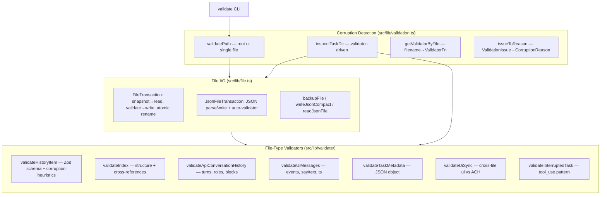

### `scanStorage` + `inspectTaskDir` (Detection)

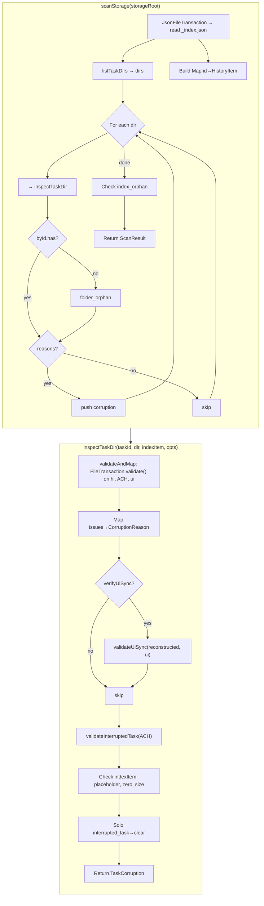

### `repairTaskDir` (Repair)

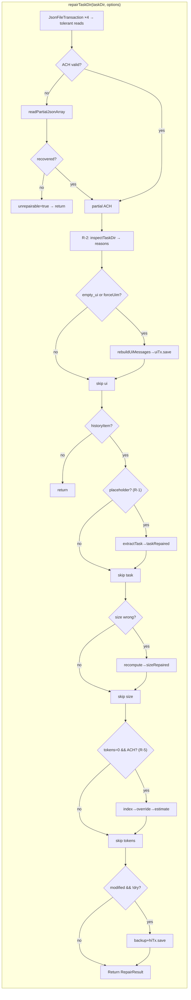

### `repairAllCorrupted` (repair-all)

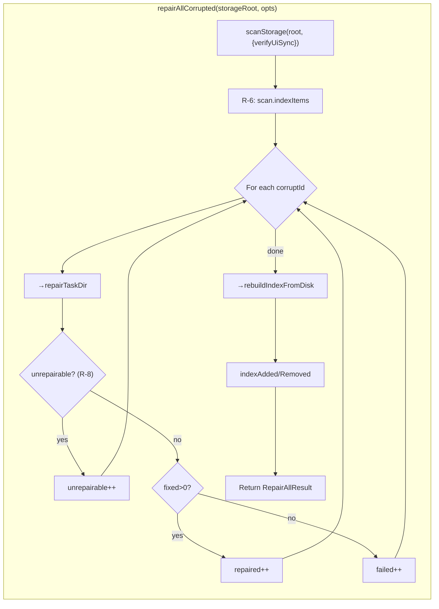

### `rebuildIndexFromDisk`

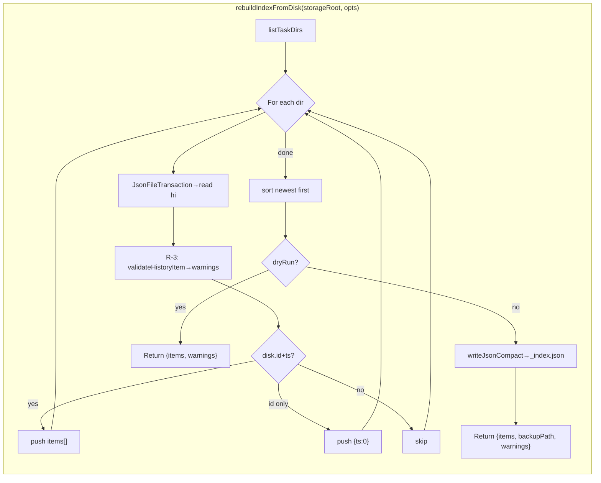

### `repairIndex`

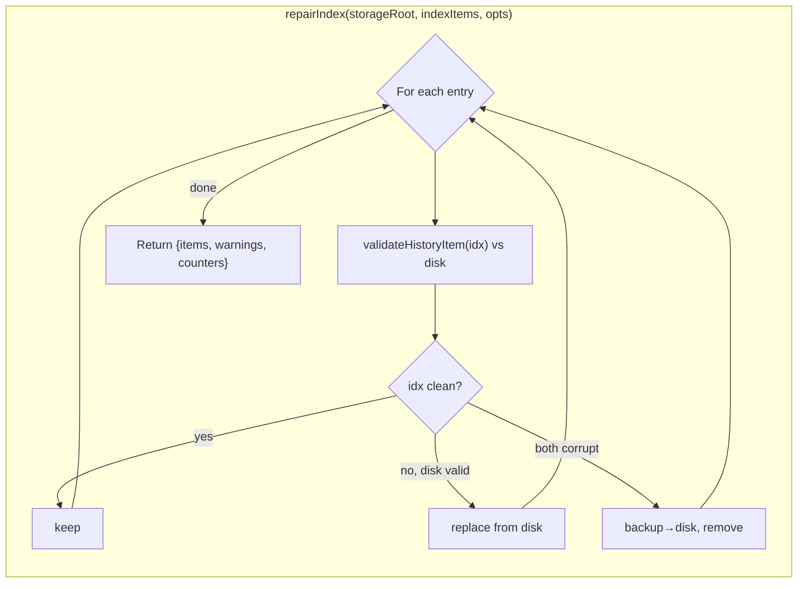

### Command: `scan`

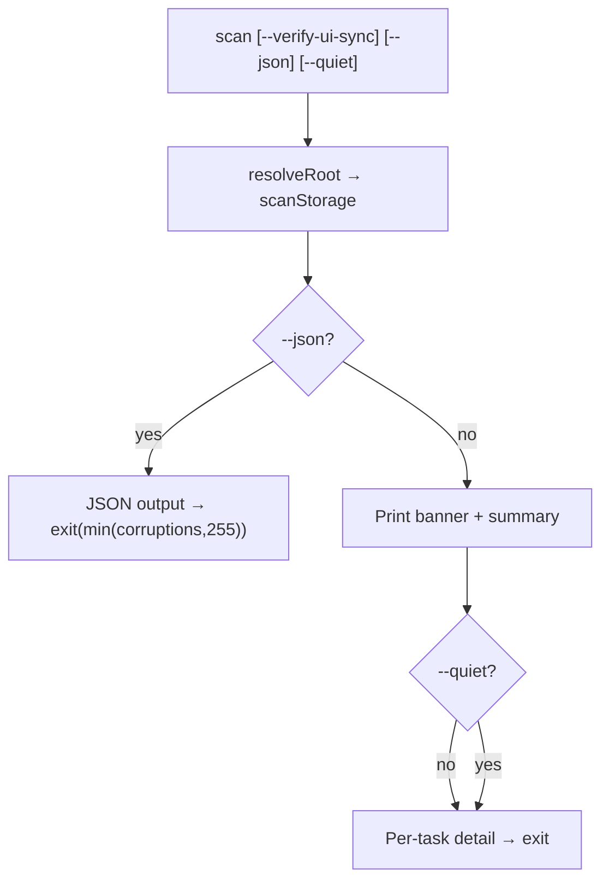

### Command: `list-corrupted`

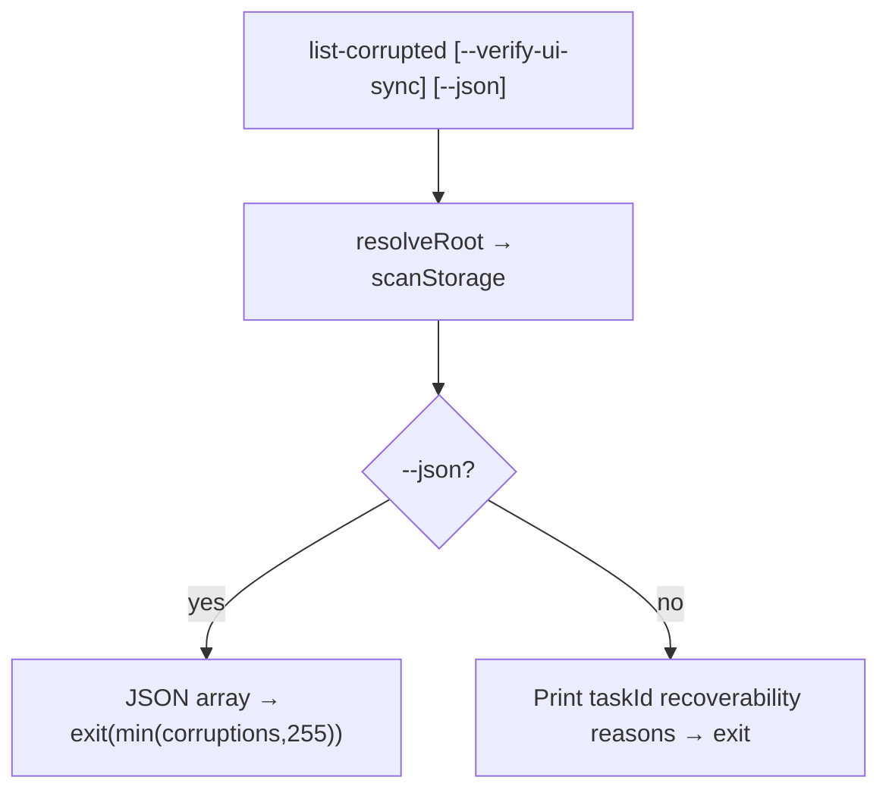

### Command: `rebuild-index`

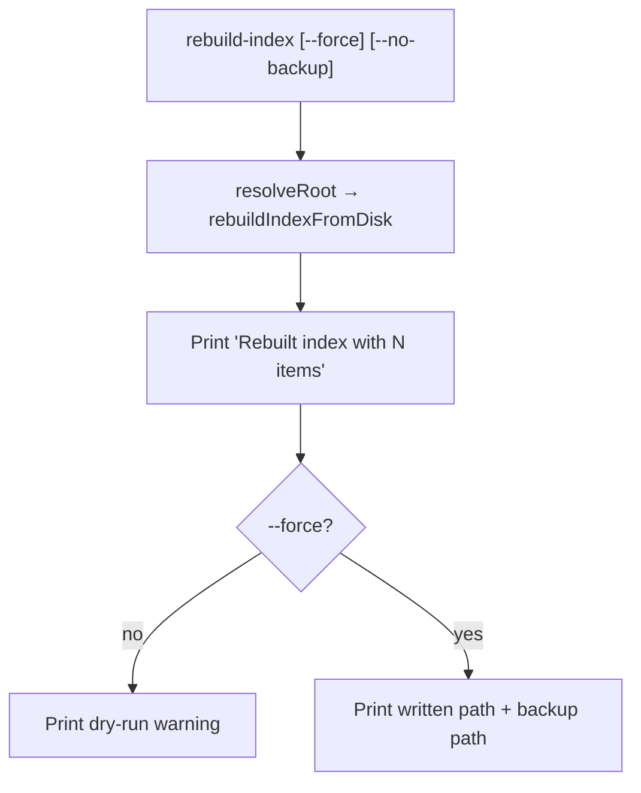

### Command: `repair-task`

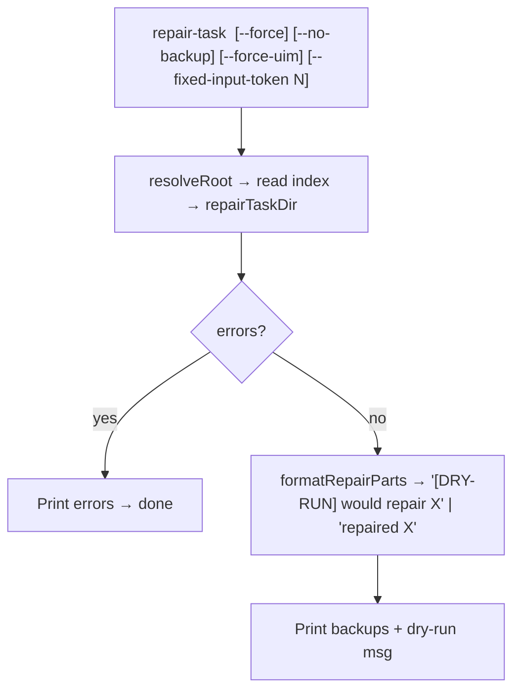

### Command: `repair-all`

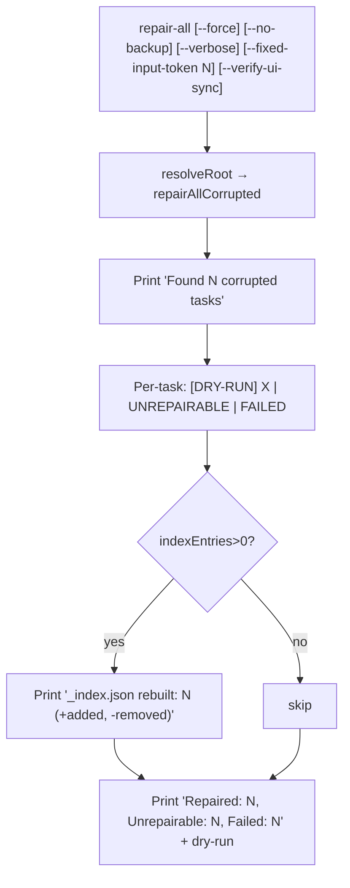

### Command: `validate`

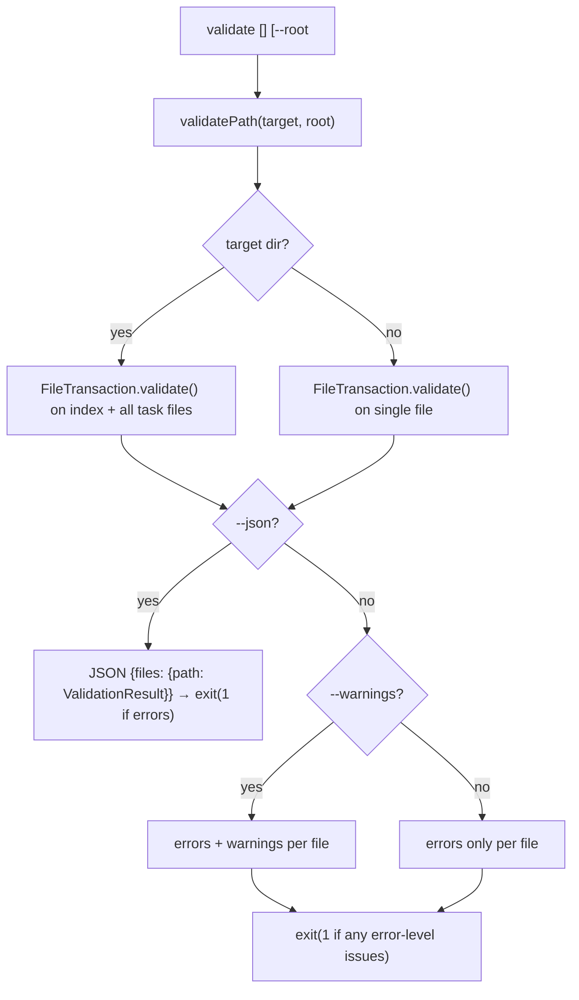
## Development

### Integration Test Fixtures

Integration tests run against scrambled real-world task data in `tests/fixtures/tasks/`.
All text content is replaced with exact byte-length lorem ipsum while preserving
JSON structure and corruption patterns.

To regenerate fixtures from source:

```bash
npx tsx scripts/scramble-fixture.ts [<source-dir>] <taskId> [taskId...]
```

The script copies from Zoo Code storage (auto-detected from `~/.zoo-code` or
passed as first argument), scrambles all text fields with exact byte-length
replacement, and writes to `tests/fixtures/tasks/`. It also builds `_index.json`
and a `tests/fixtures/hashes.json` manifest with SHA1 hashes for repair
verification. Tasks not found in the source index are automatically treated as
folder orphans (excluded from output index).

The scramble source defaults to `tests/fixtures/scramble_mixed.txt`. To
regenerate it:

```bash
npx tsx scripts/generate_scramble.ts
```

This fetches War & Peace (Gutenberg) and TypeScript checker.ts (GitHub), mixes
them, and writes a ~535KB file. On error (no internet), the scramble script
falls back to embedded lorem ipsum.

Run integration tests:

```bash
npx vitest run src/lib/__tests__/integration/
```

## Library API

All functionality is available programmatically — useful for IDE plugin integration:

```typescript
import {
    scanStorage,
    IndexTransaction,
    repairTaskDir,
    repairAllCorrupted,
    rebuildUiMessages,
    extractTaskFromApiHistory,
    computeTaskSize,
    compactSizeBytes,
} from "zoo-code-history-repair"
```

## File Format Notes

- All JSON files use **compact format** (single line, no whitespace between tokens)
- `_index.json` structure: `{"version": 1, "updatedAt": <millis>, "entries": [...]}`
- `history_item.json` fields are mirrored in `_index.json` entries
- Tool names in `ui_messages.json` use camelCase (e.g., `readFile`, `executeCommand`)

## License

MIT
