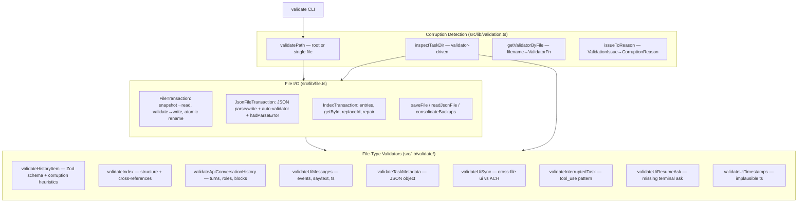
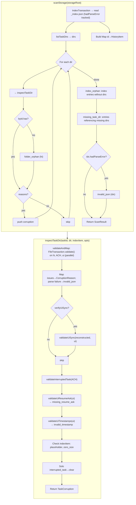
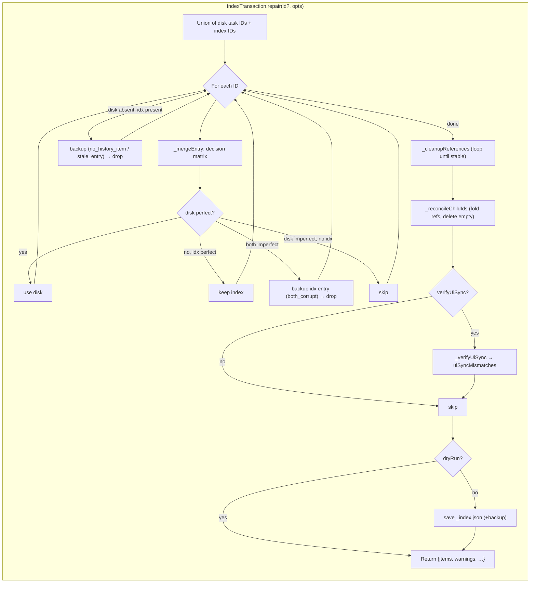
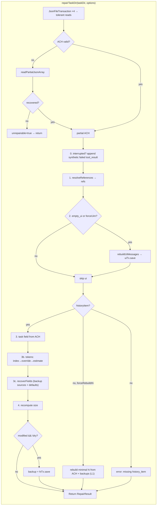
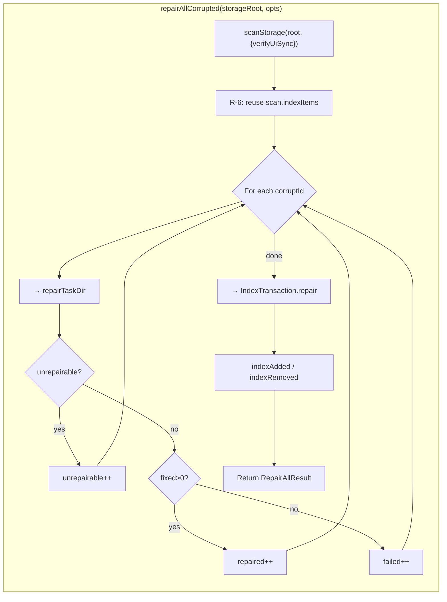
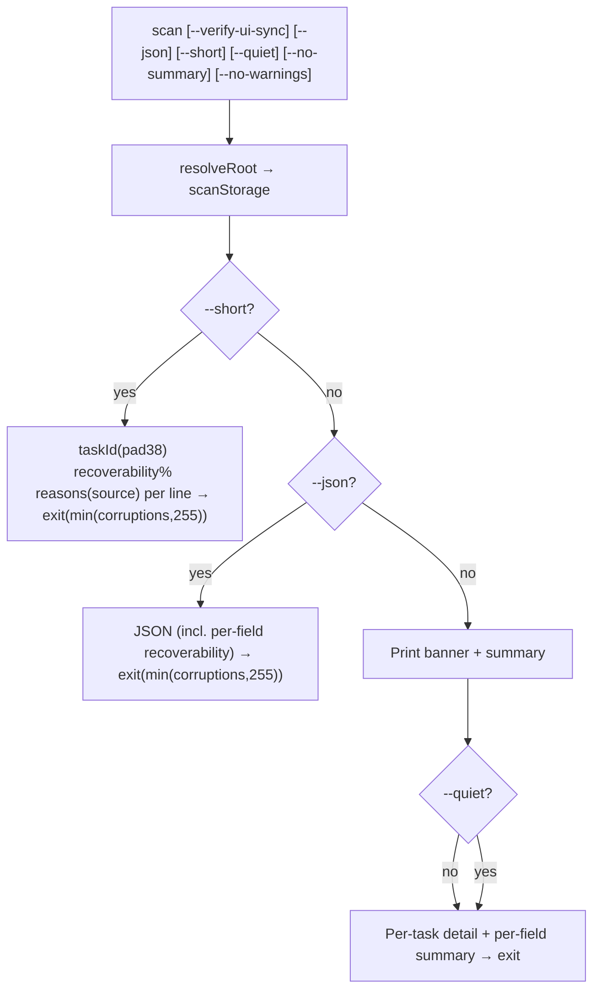
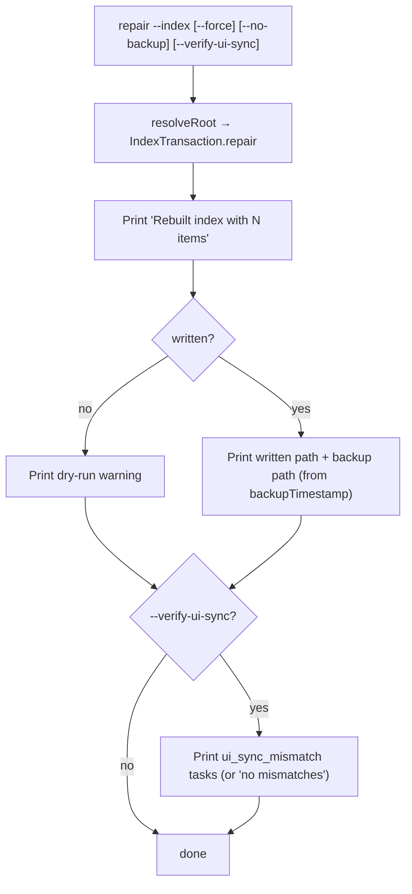
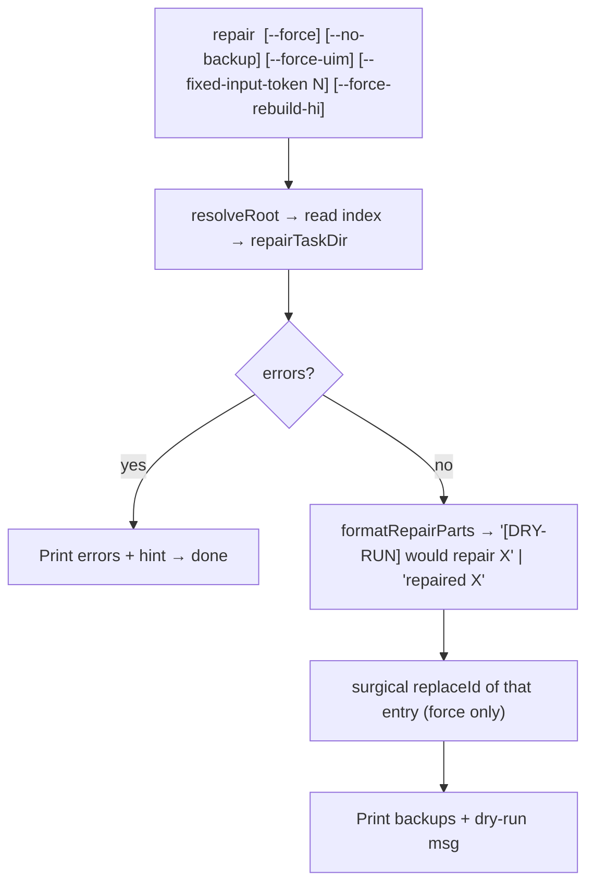
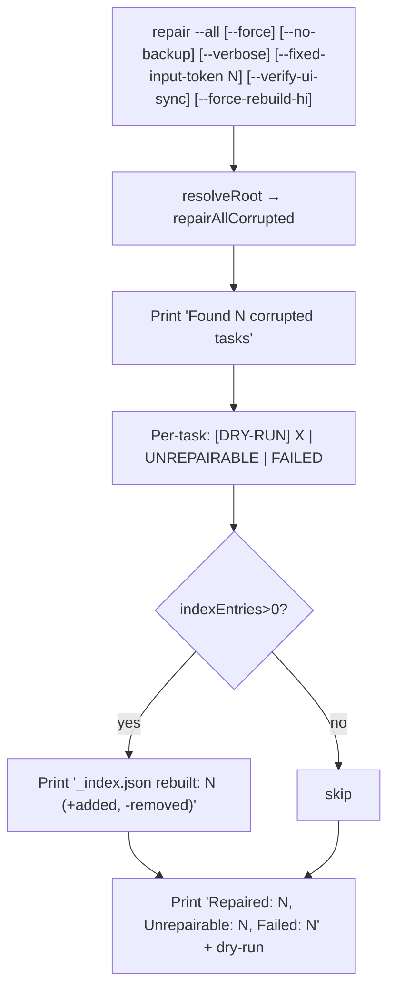
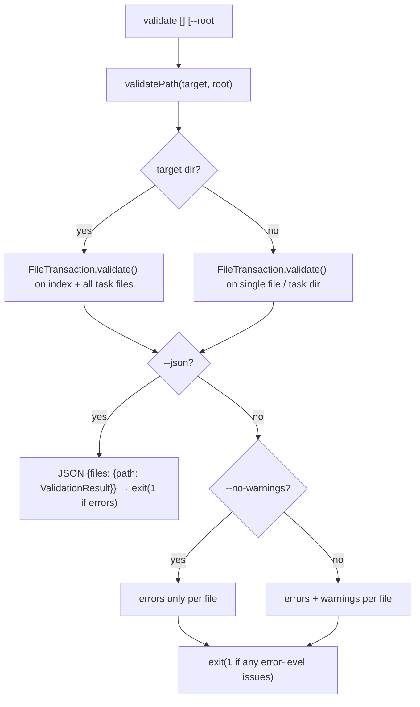

# Zoo Code History Repair — Specification

Canonical specification for `zoo-code-history-repair`. This document reflects the
implementation as of package version `0.7.1` after the Reconcile v1.1 work
(Blocks 0–6). It is the maintained, non-UAMF source of truth for command
behavior, repair algorithms, the backup/restore model, the detection model, the
file I/O model, the validation model, and the per-field recoverability report.

Companion documents: [`README.md`](README.md) (overview + quick start),
[`ROADMAP.md`](ROADMAP.md), [`CHANGELOG.md`](CHANGELOG.md).

---

## 1. Storage Layout

Zoo Code / Roo-code stores task history as JSON files under the storage root
(`~/.zoo-code/globalStorage/wecode-ai.zoo-code/tasks/` by default; override with
`--root <path>`). Each task directory contains:

| File                            | Purpose                                                                          |
| ------------------------------- | -------------------------------------------------------------------------------- |
| `history_item.json`             | Task metadata (id, task prompt, token usage, size, references, status)           |
| `api_conversation_history.json` | Full API conversation log (turns with content blocks)                            |
| `ui_messages.json`              | UI-rendered message events (derived from API history)                            |
| `task_metadata.json`            | Additional task context (`files_in_context`) — optional                          |
| `_index.json`                   | Global index of all tasks: `{"version": 1, "updatedAt": <ms>, "entries": [...]}` |

`history_item.json` fields are mirrored in `_index.json` entries.

---

## 2. Commands (CLI)

There are **5 commands**. Every command prints the version banner; `--no-color` /
`NO_COLOR` / TTY detection governs ANSI color. Global `-r, --root <path>`
resolves the storage root. All write commands default to **dry-run**; `--force`
applies the changes.

### 2.1 Global options

| Option              | Behavior                                                             |
| ------------------- | -------------------------------------------------------------------- |
| `-v, --version`     | Print version information (`Zoo Code History Repair, v<version>`)    |
| `--version-only`    | Print the version number only (e.g. `0.7.1`)                         |
| `--no-color`        | Disable ANSI color output                                            |
| `-r, --root <path>` | Storage root (directory containing `tasks/`). Omitted → auto-detect. |
| `help <command>`    | Detailed per-command help                                            |

### 2.2 Command table

| Command                        | Args / options                                                                                             | Behavior                                                                                                                                                                                                    |
| ------------------------------ | ---------------------------------------------------------------------------------------------------------- | ----------------------------------------------------------------------------------------------------------------------------------------------------------------------------------------------------------- |
| `scan`                         | `--verify-ui-sync`, `--json`, `--short`, `--quiet`, `--no-summary`, `--no-warnings`                        | Cross-reference `_index.json` vs task dirs; report `TaskCorruption[]` with recoverability %, ACH/UIM entry counts, `task.match`, and per-field recoverability; exit code = corruption count (capped at 255) |
| `scan --short`                 | `--verify-ui-sync`, `--json`, `--no-summary`, `--no-warnings`                                              | Compact `taskId(pad38) recoverability% reasons(source)` lines; JSON mode                                                                                                                                    |
| `validate [file\|uuid\|dir]`   | `--json`, `--no-warnings`                                                                                  | Run per-file validators; errors and warnings are shown **by default**; `--no-warnings` hides warnings; exit 1 on errors                                                                                     |
| `repair --index`               | `--force`, `--no-backup`, `--verify-ui-sync`                                                               | [`IndexTransaction.repair()`](src/lib/IndexTransaction.ts:189) — unified merge algorithm; writes `_index.json`; `--verify-ui-sync` cross-checks `ui_messages.json` against the ACH reconstruction           |
| `repair <taskId>`              | `--force`, `--no-backup`, `--force-uim`, `--fixed-input-token <n>`, `--force-rebuild-hi`                   | Repair ui/task/size/tokens/refs/interrupted/fields for one task, then surgical `replaceId` of that entry only                                                                                               |
| `repair --all`                 | `--force`, `--no-backup`, `--verbose`, `--fixed-input-token <n>`, `--verify-ui-sync`, `--force-rebuild-hi` | Scan → per-task repair → rebuild `_index.json`; reports repaired / unrepairable / failed + index add/remove                                                                                                 |
| `restore [taskId] [timestamp]` | `--delete`, `--force`, `--type <t>`, `--diff`                                                              | List / restore / delete backups; `--diff` shows a field-by-field JSON diff                                                                                                                                  |
| `delete <taskId>`              | `--force`, `--no-backup`                                                                                   | Delete the task directory + strip the `_index.json` entry                                                                                                                                                   |

`repair` requires **exactly one** mode selector: `--index`, `--all`, or a
`<taskId>` positional argument; any other combination errors with usage.

Warnings polarity is uniform: warnings are **ON by default** everywhere; the
`--no-warnings` flag suppresses them (`scan` / `scan --short`, `validate`).

---

## 3. Repair / Recovery Algorithms

### 3.1 Index merge ([`IndexTransaction.repair()`](src/lib/IndexTransaction.ts:189))

A single unified merge algorithm (no `fromDisk`):

1. Union of disk task IDs and index IDs.
2. `_mergeEntry` per ID using the **decision matrix** (priority order):
    - Disk perfect (0 errors, 0 warnings) → use disk.
    - Disk imperfect + index perfect → keep index.
    - Disk imperfect + index imperfect → back up index entry (`both_corrupt`), drop both.
    - Disk imperfect + no index → skip.
    - Disk absent + index present → back up index entry
      (`no_history_item` when the directory exists, `stale_entry` when it does not), drop.
3. `_cleanupReferences` — loop until stable; **nullify** dangling refs (never remove
   the entry). `awaitingChildId` dangling → `status="interrupted"`, clear
   `awaitingChildId` + `delegatedToId` (`dangling_awaiting_child`); other dangling
   refs are nullified in place (`dangling_ref`). `_nullifyRef` clears only the
   reference field — the entry's `status` is left untouched (status no longer
   depends on `parentTaskId`).
4. `_reconcileChildIds` — fold `awaitingChildId` / `completedByChildId` /
   `delegatedToId` into `childIds`; delete the `childIds` key when it ends up
   empty (no empty array is persisted).
5. Write (unless dry-run). Summary line:
   `orphan: i disk, j index; corrupt: x disk, y index; errors: a disk, b index; warnings: c disk, d index`.

### 3.2 Task repair ([`repairTaskDir()`](src/lib/repairTask.ts:154))

Order of operations:

1. **Interrupted-task marker** — append a synthetic failed `tool_result` (§3.7).
2. **Reference-field recovery** — [`resolveReferences()`](src/lib/resolveReferences.ts:186) (§3.3).
3. **`ui_messages.json` rebuild** — when empty / corrupt / forced (§3.6).
4. **`task` field** — extract from ACH when missing or placeholder (§3.6).
5. **Token repair** — priority: index recovery → user override → estimation;
   then `cacheReads` estimation and `cacheWrites` default (`0`) (§3.5).
6. **Backup-source field recovery with defaults** — [`recoverFields()`](src/lib/resolveReferences.ts:403) (§3.4).
7. **`size` recompute** — after all mutations (§3.5).

Opt-in flags: `--force-uim` forces a `ui_messages.json` rebuild; `--fixed-input-token 0`
disables estimation (keeps zeros).

### 3.3 Reference-field recovery ([`resolveReferences()`](src/lib/resolveReferences.ts:186))

Per-field priority (own ACH → cross-task index → backups → unset):

-   `completedByChildId` / `childIds` / `delegatedToId`: own ACH UUID search first.
-   `parentTaskId`: cross-task index first (entry whose `childIds`/`delegatedToId`
    references this task), then ACH, then backups.
-   `rootTaskId`: walk the recovered parent chain to the root; else unset.
-   `awaitingChildId`: unset (no reliable recovery source).
-   `reconcileStatus`: `delegated` missing any required ref (`delegatedToId`,
    `awaitingChildId`, non-empty `childIds`, `completedByChildId`,
    `completionResultSummary`) → `interrupted` + clear `delegatedToId`/
    `awaitingChildId`; `active` carrying `awaitingChildId` → unset it.

### 3.4 Field recovery with defaults ([`recoverFields()`](src/lib/resolveReferences.ts:403))

When a field is missing/zero, search backup sources in priority order
(live index entry → task backups `history_item.json.*` / `_index.task.*` →
root `_index.json.*`), then fall back to defaults:

-   **Numeric** (`tokensIn`, `tokensOut`, `totalCost`, `cacheReads`, `cacheWrites`,
    `number`): highest non-zero value across sources. `number` falls back to `1`.
-   **Scalar strings** (`mode`, `workspace`, `apiConfigName`): first non-empty value
    across sources, else the default — `mode:"unknown"`, `workspace:os.homedir()`,
    `apiConfigName:"unknown"`.

`parentTaskId` recovery is handled separately by `resolveReferences`.

### 3.5 Token / size estimation

-   **Token estimation** ([`estimateTokens.ts`](src/lib/estimateTokens.ts)):
    -   `tokensOut` ≈ assistant `text`/`reasoning` chars + tool-use input JSON ÷ `3.44` chars/token.
    -   `tokensIn` ≈ user `text` + `tool_result` content ÷ `4.0` chars/token
        (deliberate under-estimate — system prompt / tool definitions are not in ACH).
    -   `totalCost` from hardcoded DeepSeek/default pricing (`$0.14` in / `$0.28` out per 1M);
        unknown provider → `0`.
    -   `cacheReads ≈ 0.97 × tokensIn` (DeepSeek/default); `0` for Grok/unknown.
-   **Size computation** ([`computeTaskSize()`](src/lib/size.ts:21)): sum of compact
    UTF-8 byte sizes of `ui_messages` + `api_conversation_history` + `history_item`
    (minus its `size` field) + `task_metadata`.

### 3.6 `ui_messages` reconstruction ([`rebuildUiMessages()`](src/lib/rebuildUiMessages.ts:167))

ACH block mapping:

| API block type                      | Role             | UI `say`    | Payload                                                                                                                       |
| ----------------------------------- | ---------------- | ----------- | ----------------------------------------------------------------------------------------------------------------------------- |
| `text`                              | user             | `text`      | Raw text (`<user_message>` wrapper + environment details stripped; the `[ERROR] You did not use a tool…` reminder is omitted) |
| `text`                              | assistant        | `text`      | Raw text (`<user_message>` wrapper + environment details stripped)                                                            |
| `reasoning`                         | assistant        | `reasoning` | Raw text                                                                                                                      |
| `tool_use`                          | assistant        | `tool`      | JSON descriptor, camelCase tool name                                                                                          |
| `tool_use` (`new_task` / `newTask`) | assistant        | `tool`      | `newTask` descriptor with position-resolved `taskId`                                                                          |
| `tool_result` (error)               | user             | `error`     | Concatenated result content                                                                                                   |
| `tool_result` (ok)                  | user             | _(skipped)_ | —                                                                                                                             |
| `image`                             | user / assistant | `text`      | `[Image: media/type]` placeholder                                                                                             |

Tool names are normalized `snake_case` → `camelCase`. MCP tools (`mcp--` prefix)
include `serverName`, `toolName`, and `arguments` in the descriptor. Timestamps
are turn-level `ts` plus monotonic +1 ms increments. `newTask` rows resolve
`taskId` by position from the parent's `childIds` + `delegatedToId`.

When the repair pipeline rebuilds `ui_messages.json`, it appends a trailing
`ask` event after all ACH-derived events — `resume_completed_task` when the task
`status` is `"completed"`, otherwise `resume_task` (a missing status counts as
non-completed). The pure ACH→UIM reconstruction used by validation omits this
terminal ask.

The `task` field is extracted from the first `<user_message>…</user_message>`
block in the first user turn via
[`extractTaskFromApiHistory()`](src/lib/rebuildTaskField.ts:17).

### 3.7 Interrupted-task marker

When the ACH's last turn ends with an assistant `tool_use` (unanswered tool
call), a synthetic user `tool_result` is appended with `is_error:true` and
content `"Task was interrupted before completion."`. The synthetic turn inherits
a `ts` from the last ACH turn (+1 ms) so the reconstructed `say: error` event
carries a real epoch timestamp instead of a `0`-derived counter value.

### 3.8 `--force-rebuild-hi`

When a task's `history_item.json` is missing, rebuild a minimum-viable
`history_item.json` from ACH + backups instead of returning "cannot repair":

-   `id` — task directory basename.
-   `ts` — first numeric `ts` in ACH, else first numeric `ts` in backup metadata.
-   `task` — via `extractTaskFromApiHistory`.
-   remaining fields — via `recoverFields` (§3.4).
-   `size` — recomputed after rebuild.

Writes through the standard backup flow.

---

## 4. Backup / Restore Model

### 4.1 Naming

-   General: `{basename}.{YYYYMMDD-HHmmss}.bak.json`. `backupTimestamp` is a
    module-level session constant ([`file.ts`](src/lib/file.ts:89)).
-   **Per-task index-entry extract**: `_index.task.{ts}.bak.json` (carries
    `_removedReason` + `_removedAt`; restores to `history_item.json`).
-   **Full index file**: `_index.json.{ts}.bak.json` (the natural
    `{basename}.{ts}.bak.json` produced by `FileTransaction.save()` with
    `backup:true`).

`_removedReason` values: `both_corrupt` | `no_history_item` | `stale_entry` |
`dangling_ref` | `dangling_awaiting_child`. One backup per entry per repair run
(first reason wins).

### 4.2 Consolidation ([`consolidateBackups()`](src/lib/file.ts:315))

Deduplicate backups by content hash (with volatile `updatedAt` / `ts` stripped):
remove backups identical to the target file, and remove a new backup when its
content matches an existing backup. Applied to `FileTransaction` saves **and**
to `_index.task` backups.

### 4.3 Restore ([`restore.ts`](src/lib/restore.ts))

-   `_index.task` backups restore to `history_item.json` (with `_removedReason` /
    `_removedAt` metadata stripped), optionally merged into the global index via
    `replaceId(..., validate=false)`.
-   `history_item` restores create a safety backup first
    ([`safetyBackup()`](src/lib/restore.ts:308)).
-   Idempotent: group matching skips already-matching targets.

### 4.4 Type filter (`--type`)

`history_item` (restore/delete default) | `ui_messages` |
`api_conversation_history` | `task_metadata` | `_index` | `_index.task` | `all`
(list default).

### 4.5 Diff ([`diffBackup()`](src/lib/restore.ts:166))

Deep-compares a backup against its current target; dotted-path diffs plus an
unchanged-field count. For `_index.task` the target is `history_item.json` and
the backup metadata is stripped before comparison.

---

## 5. Detection Model

[`inspectTaskDir()`](src/lib/validation.ts:150) is **validator-driven**. Validator
issue codes are mapped to `CorruptionReason`s via
[`issueToReason()`](src/lib/validation.ts:71), each annotated with a source
abbreviation (`hi` / `idx` / `uim` / `ach` / `tmd` / `uim,ach`). Cross-file checks
(`ui_sync_mismatch`, `interrupted_task`, `missing_resume_ask`,
`invalid_timestamp`) are validators. `missing_resume_ask` is error-level and
always reported; `invalid_timestamp` is warning-level (suppressed by
`--no-warnings`). A solo `interrupted_task` with no co-occurring corruption is
suppressed.

### 5.1 `CorruptionReason` values (17)

| #   | Reason                  | Source(s)                            | Detection                                                          |
| --- | ----------------------- | ------------------------------------ | ------------------------------------------------------------------ |
| 1   | `placeholder_task_name` | `hi` / `idx`                         | `task` matches "Task #N" / "Task #N (…)" pattern                   |
| 2   | `zero_size`             | `hi` / `idx`                         | `size` is 0 or null/missing (`ZERO_SIZE` / `MISSING_SIZE`)         |
| 3   | `missing_task_text`     | `hi`                                 | disk `task` field empty/whitespace-only                            |
| 4   | `missing_history_item`  | `hi`                                 | `history_item.json` missing or unreadable                          |
| 5   | `invalid_json`          | `hi` / `idx` / `ach` / `uim` / `tmd` | a JSON file fails to parse (or `_index.json` itself)               |
| 6   | `missing_task_dir`      | `idx`                                | an index entry references a task ID whose directory is absent      |
| 7   | `empty_ui_messages`     | `uim`                                | `ui_messages.json` is an empty array                               |
| 8   | `empty_api_history`     | `ach`                                | `api_conversation_history.json` is an empty array                  |
| 9   | `index_orphan`          | `idx`                                | entry in `_index.json` has no task directory on disk               |
| 10  | `folder_orphan`         | `hi`                                 | task directory on disk is absent from `_index.json`                |
| 11  | `ui_sync_mismatch`      | `uim,ach`                            | (opt-in) `ui_messages.json` differs from ACH reconstruction        |
| 12  | `interrupted_task`      | `ach`                                | last turn ends with `tool_use` (gated: solo occurrence suppressed) |
| 13  | `zero_tokens`           | `hi`                                 | `tokensIn` / `tokensOut` / `totalCost` all 0 but ACH has entries   |
| 14  | `missing_resume_ask`    | `uim`                                | non-empty `ui_messages.json` doesn't end with a terminal `ask`     |
| 15  | `invalid_timestamp`     | `uim` / `hi` / `idx`                 | a UIM event or history_item `ts` < 1e12 (not a plausible epoch)    |
| 16  | `missing_ui_messages`   | `uim`                                | `ui_messages.json` is missing                                      |
| 17  | `dangling_child_ref`    | `idx`                                | a `childIds` entry references a task with no directory             |

`zero_tokens` requires all three of `ZERO_TOKENS_IN` + `ZERO_TOKENS_OUT` +
`ZERO_TOTAL_COST` to be present. `zero_size` maps from `ZERO_SIZE` / `MISSING_SIZE`.

---

## 6. File I/O Model

-   [`safeWriteJson()`](src/lib/io/safeWriteJson.ts:70) — vendored from Zoo Code,
    extended with `stringify` + `keepBackup`: inter-process advisory lock
    (`proper-lockfile`), streaming write (`json-stream-stringify`), atomic
    temp→rename, rollback on error.
-   [`saveFile()`](src/lib/file.ts:174) — snapshot-based concurrent-modification
    check, then `safeWriteJson`; returns a fresh stat snapshot.
-   [`FileTransaction`](src/lib/file.ts:358) (default `readOnly=true`) —
    `load()` / `save()` / `validate()` / `setData()` / `getData()`; snapshot on
    read; validator auto-registration by filename (via `getValidatorByFile`);
    `save()` throws on read-only; backup consolidation after save.
-   [`JsonFileTransaction`](src/lib/file.ts:550) — JSON parse/serialize
    (`stringify` default true); exposes `hadParseError()`.
-   [`IndexTransaction`](src/lib/IndexTransaction.ts:46) extends
    `JsonFileTransaction` — `getEntries()`, `getById(id, fromDisk)`,
    `getFullIndex()`, `getKnownTaskIds()`, `removeById()`, `replaceId()`,
    `repair()`. All async. The index validator is auto-registered (no longer
    suppressed).
-   [`readJsonFile()`](src/lib/file.ts:121) — tolerant read (null on error).
-   [`readPartialJsonArray()`](src/lib/io/readJson.ts:18) — truncated JSON array
    salvage at the last valid element boundary.

---

## 7. Validation Model (Zod)

-   [`historyItemForRepair`](src/lib/validate/historyItem.ts:21) —
    `historyItemSchema.extend({…}).superRefine(…)` from `@roo-code/types`. Makes
    `size` / `workspace` / `mode` / `apiConfigName` required; adds the
    `"interrupted"` status; corruption heuristics as `.superRefine()` custom
    issues with `params:{severity, code}`.
-   [`indexSchema`](src/lib/validate/index.ts:80) — `{version, updatedAt, entries}`
    with `entriesWithRefs` `.superRefine()` (duplicate IDs, dangling refs,
    self-reference). Tolerates the legacy array-only format.
-   [`taskMetadataSchema`](src/lib/validate/taskMetadata.ts:11) — `files_in_context`
    array (path, record_state, record_source, timestamps) with top-level passthrough.
-   ACH content-block schema + `achTurnSchema`
    ([`apiConversationHistory.ts`](src/lib/validate/apiConversationHistory.ts)).
-   [`uiMessageEventSchema`](src/lib/validate/uiMessages.ts:63) — 28 `say` values
    and 11 `ask` values aligned with Zoo Code.
-   [`zod.ts`](src/lib/validate/zod.ts) translation helpers
    (`zodIssueToValidationIssue`, `zodResultToValidationResult`) preserve the
    `ValidationResult` return shape.

`ValidationResult` = `{valid, issues[], errorCount, warningCount}` with severity
`"error" | "warning"`.

---

## 8. Per-Field Recoverability (L4)

[`perFieldRecoverability()`](src/lib/scanOutput.ts:212) is a read-only simulation
of what [`repairTaskDir()`](src/lib/repairTask.ts:154) would do, reusing the exact
recovery functions rather than a parallel approximation.

For each field — `tokensIn`, `tokensOut`, `totalCost`, `cacheReads`, `cacheWrites`,
`number`, `mode`, `workspace`, `apiConfigName`, `task`, `refs` — it reports a
structured `FieldRecoverability`:

```ts
interface FieldRecoverability {
	source: "ach" | "index" | "backup" | "default" | "none"
	confidence: "high" | "medium" | "low"
	estimatedValue: unknown // post-repair value, or null when unrecoverable
}
```

-   `source` — where the post-repair value comes from (`ach` = task extraction /
    token estimation / reference recovery; `index` = `_index.json` entry;
    `backup` = task/root index backups; `default` = configured fallback; `none`).
-   `confidence` — `high` (exact value), `medium` (estimated/derived), `low`
    (default or unrecoverable).
-   `source:"none"` + `confidence:"high"` = field already holds an exact value;
    `source:"none"` + `confidence:"low"` = repair cannot fill it.

Surfaced in `scan --json` (as `fields`) and in human output as a compact summary
line via `formatPerFieldSummary`.

---

## 9. Architecture

### Validation Infrastructure



### `scanStorage` + `inspectTaskDir` (Detection)



### `IndexTransaction.repair` (Index Merge)



### `repairTaskDir` (Repair)



### `repairAllCorrupted` (repair-all)



### Command: `scan`



### Command: `repair --index`



### Command: `repair <taskId>`



### Command: `repair --all`



### Command: `validate`



---

## 10. File Format Notes

-   All JSON files use **compact format** (single line) — produced via
    `json-stream-stringify` with indentation disabled.
-   File writes use **atomic rename** with inter-process locking
    (`proper-lockfile`) and backup-before-overwrite.
-   `_index.json` structure: `{"version": 1, "updatedAt": <millis>, "entries": [...]}`.
-   `history_item.json` fields are mirrored in `_index.json` entries.
-   Tool names in `ui_messages.json` use camelCase (e.g. `readFile`, `executeCommand`).

---

## 11. Library API

All functionality is available programmatically:

```typescript
import {
	scanStorage,
	IndexTransaction,
	repairTaskDir,
	repairAllCorrupted,
	rebuildUiMessages,
	extractTaskFromApiHistory,
	computeTaskSize,
	compactSizeBytes,
	readPartialJsonArray,
	inspectTaskDir,
} from "zoo-code-history-repair"
```

Exports are declared in [`src/index.ts`](src/index.ts).
